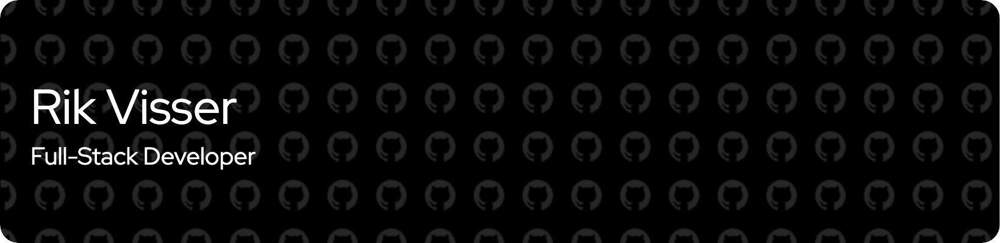

  

<h1 align="center">Hi 👋, I'm Rik</h1>
<h3 align="center">A passionate full-stack developer from The Netherlands with a love for building innovative solutions.</h3>

  
  

---

### 📌 About Me

- 🔭 I’m currently working on **[Breeze Radio](https://breezeradio.nl)**, developing and maintaining the entire tech stack.
- 🌱 I’m currently diving deeper into **Swift** to build beautiful native iOS applications.
- 💬 Ask me about anything related to **full-stack development** or **custom solutions for radio stations**.
- ⚡ Fun fact: When I'm not coding, you can find me behind the microphone as a **radio DJ**!

---

### 💻 Tech Stack

  
  
  
  
  
  
  
  
  
  
  
  
  
  
  
  
  

---
### 📊 GitHub Stats

  
  

